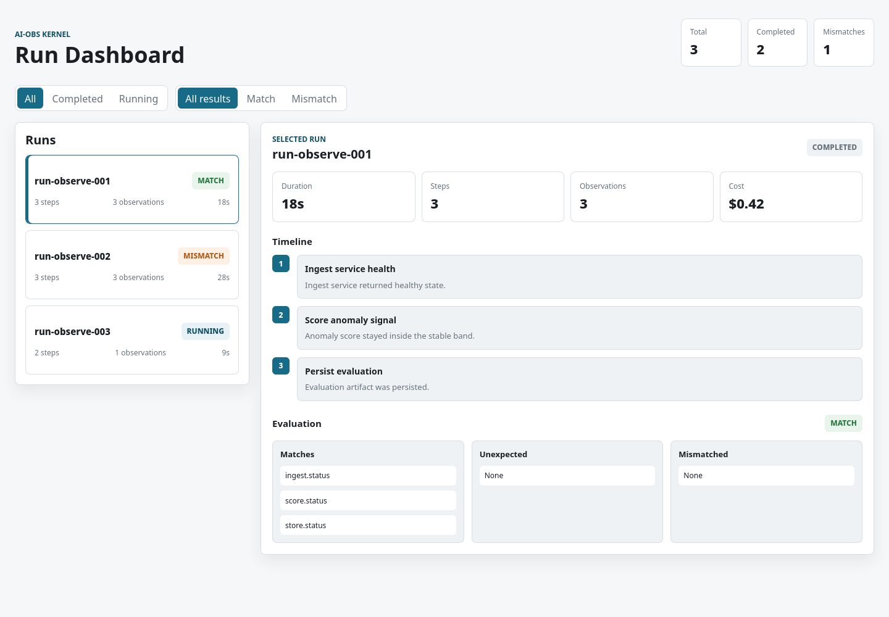

# AI-Obs

AI-Obs is an observability layer for AI-agent runtimes: it captures what a
run *expected* to happen against what it *actually observed*, computes the
delta between the two, and surfaces metrics and alerts over that delta.

**Status: MVP.** Everything under [Current Status](#current-status) below
is real and tested. Everything under Planned is not — and the README says
so explicitly rather than blurring the line.

## What is AI-Obs?

An AI system's internal signals — a tool call returning `200`, a step
finishing "successfully" — can look fine while the actual outcome quietly
diverges from what was expected. AI-Obs is built around making that
divergence a first-class, observable thing:

```text
Gap = Representation − Reality
```

In this MVP, that's not a metaphor — it's the literal mechanism at the
core of the Kernel (`backend/app/kernel.py`): every run step declares an
*expected state*, every observation reports a *observed state*, and the
Kernel computes a deterministic diff between the two (`MATCH` /
`MISMATCH`, with the specific missing, unexpected, and mismatched keys).
That's the whole of what "Gap" means today: a narrow, per-run,
key/value comparison — not a statistical drift detector, not a
confidence-recalibration system, not a trend over time. Those are
directions the project could grow into, not things it does now (see
[Roadmap](#roadmap)).

## Why

AI-agent systems fail in ways that don't always show up as errors. A step
can report success while doing the wrong thing; a run can look "healthy" by
every internal signal while producing an output nobody asked for. Most
observability tooling watches infrastructure health (is the service up,
is latency low) rather than whether the system's own account of what it
did matches what actually happened. AI-Obs starts from that second
question.

## What the MVP Does

Everything below is implemented and covered by tests in `backend/tests/`:

- **`backend/app/kernel.py`** — records run steps, observations, and a
  deterministic expected-vs-observed evaluation through an in-memory store.
- **`backend/app/operational_observability.py`** — summarizes Kernel run
  metrics (latency, duration, evaluation match/mismatch) and detects slow,
  stuck, errored, and mismatched runs; builds Slack/Discord notification
  messages without performing network I/O itself.
- **`backend/app/latency_analytics.py`** — a focused latency/duration
  summary facade over the same data.
- **`backend/app/run_anomaly_detection.py`** — a focused anomaly report for
  slow, stuck, and errored runs.
- **`backend/app/alert_dispatch.py`** — sends detected alerts to configured
  Slack or Discord webhooks, converting provider failures into dispatch
  results instead of raising.
- **`backend/app/replay.py`** — builds an immutable, cursor-navigable
  replay timeline from a Kernel run.
- **`backend/app/run_comparison.py`** — compares two Kernel runs and
  classifies differences as noise or material.
- **`backend/app/canonical_mapping.py`** — an additive, read-only layer
  mapping Kernel payloads onto a canonical status vocabulary and latency
  metric names.
- **`frontend/dashboard.html`** — a static, dependency-free Run Explorer
  over embedded example Kernel payloads: filtering, per-run timelines,
  error/mismatch highlighting, and evaluation deltas.
- **`backend/run_demo.py`** — a single-command, zero-dependency, terminal
  demonstration of the full pipeline (event → Kernel → metrics →
  detection → console), separate from the static dashboard.

See [docs/metrics.md](docs/metrics.md) and [docs/detection.md](docs/detection.md)
for the exact, code-verified list of what's computed — including what's
*not* computed yet (no p95, no cost/token metrics, no ML-based anomaly
detection).

## Architecture

```text
AI System (or the demo's synthetic event generator)
    ↓
Events
    ↓
Kernel  (expected state vs. observed state → MATCH / MISMATCH)
    ↓
Metrics / Detection  (thresholds, not statistics)
    ↓
Observability  (static dashboard, terminal demo, Slack/Discord alerts)
```

The Kernel observes and computes. It does not:

- modify models or take corrective action
- autonomously adjust weights or parameters
- execute anything outside computing a run's own recorded delta
- persist data durably (the store is in-process only)
- act as an autonomous agent of any kind

Full detail, including explicit limitations, in
[docs/architecture.md](docs/architecture.md).

## Demo

Two independent demos exist. Both are verified to run from a clean clone.

**Static dashboard** — click through example runs in a browser:

```bash
python3 -m http.server 8000
# then open http://127.0.0.1:8000/frontend/dashboard.html
```

**Runtime pipeline demo** — watch the actual pipeline run, end to end, in
a terminal (zero external dependencies, no network access required):

```bash
python3 -m venv .venv
.venv/bin/python3 backend/run_demo.py
```

See [docs/demo.md](docs/demo.md) for a full walkthrough of both.



## Quick Start

```bash
python3 -m venv .venv
.venv/bin/pip install -r backend/requirements.txt        # empty — no runtime deps
.venv/bin/pip install -r backend/requirements-dev.txt     # lint/type/test/security tooling
```

Run the test suite:

```bash
cd backend
../.venv/bin/pytest -q
```

Run the full validation gate (same as CI):

```bash
.venv/bin/flake8 backend
.venv/bin/mypy backend/app backend/run_demo.py
cd backend && ../.venv/bin/pytest -q && cd ..
.venv/bin/bandit -r backend
```

## Current Status

**Implemented**

- In-process Kernel with expected-vs-observed evaluation (MATCH/MISMATCH)
- Operational metrics: run/step counts, latency, duration, match/mismatch
  rate (full list: [docs/metrics.md](docs/metrics.md))
- Threshold-based alerting: slow run, slow step, stuck run, errored step,
  evaluation failure ([docs/detection.md](docs/detection.md))
- Slack/Discord notification formatting and webhook dispatch
- Deterministic run replay and two-run comparison (noise vs. material diff)
- Static Run Explorer dashboard over example data
- Zero-dependency, single-command terminal demo of the full pipeline
- One versioned metrics→detection handoff artifact (`run.count` only)

**Planned**

- HTTP API and durable persistence (currently: in-process Python module API
  only, no server, no database)
- Live dashboard feed from the detection engine (currently: dashboard shows
  static embedded example data only)
- A general `Event`/`Trace` model with persistence and replay across a
  wider event vocabulary (currently: the demo's synthetic `MODEL_CALL`
  event only — see [docs/event-schema.md](docs/event-schema.md))
- Cost estimation and token counting as computed metrics (currently:
  display-only pass-through of a metadata field, not calculated)
- Percentile (p95) duration metrics and baseline/rolling comparison
- Statistical or learned anomaly detection (currently: fixed thresholds
  only)

**Out of scope for this project, currently**

- Autonomous corrective action (weight adjustment, retraining, rollback)
- Multi-tenant or hosted deployment
- Authentication/authorization (no HTTP surface exists yet to authenticate)

## Roadmap

Short and directional, not a commitment:

1. Wire live detection output into the dashboard (replace embedded example
   data with a real feed).
2. Widen the Kernel evaluation beyond flat key/value state — this is where
   "Gap = Representation − Reality" grows from a per-run diff into
   something closer to genuine drift observability.
3. Add a durable persistence layer behind the current in-process store.
4. Add the HTTP API layer the module API is designed to sit behind.

## Documentation

- [Architecture](docs/architecture.md)
- [Python API](docs/api.md)
- [Metrics](docs/metrics.md)
- [Detection](docs/detection.md)
- [Event & run data shapes](docs/event-schema.md)
- [Demo guide](docs/demo.md)

## License

[Apache License 2.0](LICENSE).

## Security

See [SECURITY.md](SECURITY.md) for the vulnerability reporting process and
current scope.
